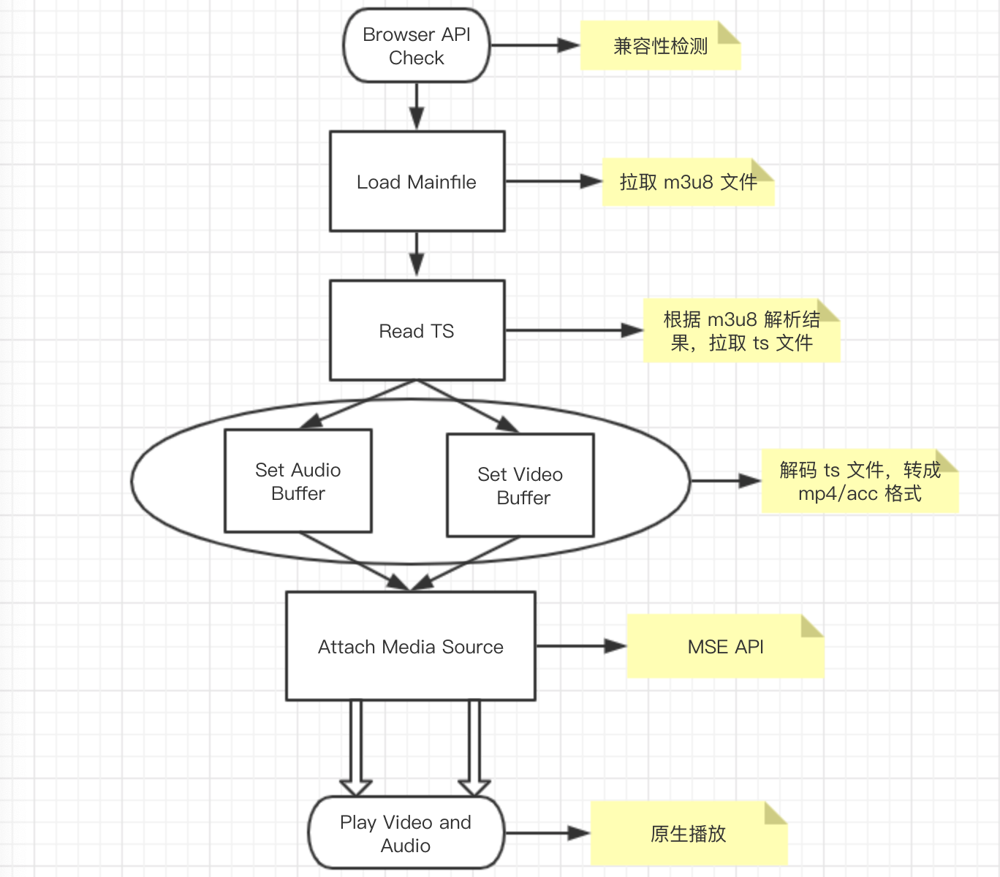

# 音视频 & 流媒体服务

## 背景
审核系统（含SAAS系统）中点播、直播音视频在浏览器端播放时，由于客户提交的音视频格式/协议众多，但浏览器支持有限，经常遇到无法播放的问题

## 两个问题
* 一个 .avi 的视频文件为什么无法在浏览器上播放
* 业务方提交的 rtmp/hls/http-flv 协议的直播流如何优雅的在浏览器上播放

## 音视频常见术语定义规范

### 音视频组成

一个完整的视频文件，包括音频、视频和基础元信息，我们常见的视频文件如mp4、mov、flv、avi、rmvb等视频文件，就是一个容器的封装，里面包含了音频和视频两部分，并且都是通过一些特定的编码算法，进行编码压缩过后的。

H264、Xvid等就是视频编码格式，MP3、AAC等就是音频编码格式。例如：将一个Xvid视频编码文件和一个MP3音频编码文件按AVI封装标准封装以后，就得到一个AVI后缀的视频文件。

因此，视频转换需要设置的本质就是

* 设置需要的视频编码
* 设置需要的音频编码
* 选择需要的容器封装

一个完整的视频转换设置都至少包括了上面3个步骤。

## 编码格式

### 音频编码格式
* AAC
* AMR
* PCM
* ogg(ogg vorbis音频)
* AC3(DVD 专用音频编码)
* DTS(DVD 专用音频编码)
* APE(monkey’s 音频)
* AU(sun 格式)
* WMA

### 常见视频编码格式

* Xvid(MPEG4)
* H264 （目前最常用编码格式）
* H263
* MPEG1，MPEG2
* AC-1
* RM，RMVBg4
* H.265

### 视频编码的意义

* 原始视频数据存储空间大，一个 1080P 的 7 s 视频需要 817 MB
* 原始视频数据传输占用带宽大，10 Mbps 的带宽传输上述 7 s 视频需要 11 分钟

而经过 H.264 编码压缩之后，视频大小只有 708 k ,10 Mbps 的带宽仅仅需要 500 ms ，可以满足实时传输的需求，所以从视频采集传感器采集来的原始视频势必要经过视频编码。

### 存储封装格式

* AVI (.avi)
* ASF（.asf)
* WMV (.wmv)
* QuickTime ( .mov)
* MPEG (.mpg / .mpeg)
* MP4 (.mp4)
* m2ts （.m2ts / .mts )
* Matroska （.mkv / .mks / .mka )
* RM ( .rm / .rmvb)
* TS/PS


### Chrome 支持的音视频编码格式和封装格式

<https://sites.google.com/a/chromium.org/dev/audio-video>

### 测试

* 文件后缀不支持：直接改文件后缀（结果：无法播放）
* 视频编码不支持（结果：视频无法播放）
```
视频编码格式：mpeg4 音频编码格式：aac 封装格式：mp4 文件后缀 .mp4

ffmpeg -i origin.mp4 -vcodec mpeg4 -acodec aac -f mp4 mpeg4_aac.mp4
```
* 音频编码不支持（结果预测：视频无法播放）

* 封装格式不支持（结果：无法播放）
```
视频编码格式：mpeg4 音频编码格式：aac 封装格式：avi 文件后缀 .mp4

ffmpeg -i origin.mp4 -vcodec h264 -acodec aac -f avi h264_aac_avi.mp4
```

### 小结

* 浏览器能否播放一个视频文件受 视频编码、音频编码、封装格式、文件后缀 共同影响

## FFmpeg 音视频处理软件包

### 获取音频/视频文件信息

```
ffmpeg -i origin.mp4 -hide_banner
```

### 转文件格式

```
以视频编码格式：mpeg4 音频编码格式：mp3 封装格式：mp4

ffmpeg -i origin.mp4 -vcodec mpeg4 -acodec mp3 -f mp4 mpeg4_mp3.mp4
```

### 给新手的 20 多个 FFmpeg 命令示例
<https://zhuanlan.zhihu.com/p/67878761>

## 直播协议
 流媒体分为直播和点播。通常来说点播使用的都是HTTP协议，直播主要用的是RTMP, HLS, HTTP-FLV等。

### RTMP（Real Time Messaging Protocol实时消息传送协议）

由Adobe公司为Flash播放器和服务器之间音频、视频和数据传输开发的私有协议,未完全公开。最大的优点是延迟点。浏览器播放需要 flash 。

### HLS 解决方案

HLS(HTTP Live Streaming) 是由Apple公司定义的用于实时流传输的协议，HLS基于HTTP协议实现，传输内容包括两部分，一是M3U8描述文件，二是TS媒体文件。其本质是利用 http 的点播技术。

#### M3U8

m3u8 文件实质是一个播放列表（playlist），内部信息记录的是一系列媒体片段资源，顺序播放该片段资源，即可完整展示多媒体资源。对于点播来说，客户端只需按顺序下载片段资源，依次进行播放即可。而对于直播来说，客户端需要定时重新请求该 m3u8 文件，看下是否有新的片段数据需要进行下载并播放。

#### TS 格式
TS（Transport Stream）是一种音视频封装格式，全称MPEG2-TS。两个 TS 片段可以无缝拼接，播放器能连续播放。

#### 测试

* FFmpeg 生成 m3u8 和 ts 文件

```
ffmpeg -i origin.mp4 origin.ts

ffmpeg -i origin.ts -c copy -map 0 -f segment -segment_list playlist.m3u8 -segment_time 5 output%03d.ts
```

* VLC 播放器单独播放 ts 文件，或直接播放 m3u8 文件

#### hls.js 处理方案

核心，在于对于 m3u8 的文件解析和 通过 XHR 去完成对分片内容二进制文件的获取，然后使用 MSE（Media Source Extensions）的 appendBuffer 去进行 buffer 的封装，然后自己完成合流的工作。



#### 更多关于 HLS 详细的介绍 
<https://juejin.im/post/5dc230a9f265da4d4b5feb7c#heading-13>

### HTTP-FLV 解决方案

即将音视频数据封装成 FLV（传输的数据与 rtmp 一样），然后通过 HTTP 协议传输给客户端。

#### flv.js 处理方案

通过流式IO去拉取数据，（支持流式IO的有 fetch 或者 stream），获取到FLV格式的音视频数据后通过原生的JS去解码FLV数据，再通过 MSE API 喂给原生HTML5 Video标签。

* hls：利用 xhr 短连接，需要不断的去请求 ts 文件，更像是点播
* http-flv：利用 fetch，建立长连接，服务端一直传输 flv 数据流

### 基于 nginx-rtmp-module + FFmpeg 的流媒体服务


### 演示

#### nginx 配置 rtmp 模块，默认监听 1935 端口
```
http {
  server {
    location /hls {
      # Serve HLS fragments
      types {
          application/vnd.apple.mpegurl m3u8;
          video/mp2t ts;
      }
      root /usr/local/nginx/html;
      add_header Cache-Control no-cache;
      #添加下面一行
      add_header Access-Control-Allow-Origin *;
    }
    
    location /live {
      flv_live on;
      chunked_transfer_encoding on; #支持'Transfer-Encoding: chunked'方式回复

      add_header 'Access-Control-Allow-Origin' '*'; #添加额外的HTTP头
      add_header 'Access-Control-Allow-Credentials' 'true'; #添加额外的HTTP头
    }
  }
}
rtmp { 
	server { 
		listen 1935; 
		chunk_size 4000; 

		#hls直播流配置 
		application live { 
			live on; 
			max_connections 1024; 
			hls on; 
			hls_path /usr/local/nginx/html/hls; 
			hls_fragment 5s; 
		} 
	} 
}
```
#### FFmpeg 推流到 1935 端口
```
ffmpeg -re -i rtmp://v3948069e.live.126.net/live/a44e3c35d15641f4a4b7527d58728034 -vcodec libx264 -acodec aac -strict -2 -f flv rtmp://localhost:1935/hls/test
```
#### 播放

* rtmp://127.0.0.1:1935/live/test
* http://localhost/hls/test.m3u8
* http://localhost/flv?app=live&stream=test

## 参考文章

* 音视频更多术语：<https://juejin.im/post/5a6873fd51882573497916bb>
* 音视频编码和封装：<https://www.jianshu.com/p/b61cd0bc2abe>
* HLS 详细的介绍：<https://juejin.im/post/5dc230a9f265da4d4b5feb7c#heading-13>